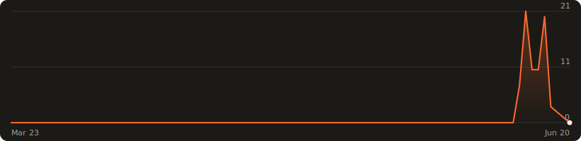

# How Much Is a Trillion?

A scroll-powered sense of scale. One page, one million WebGL particles, one
continuous camera flight from a single euro-million to the edge of human
comprehension — built to fix the broken intuition that puts "a billion"
halfway between a million and a trillion. (It sits 0.1% of the way.)



**Hosting:** self-hosted. `npm run build` produces a fully static `dist/`
(no server-side anything) — point any web server at it. Every push to `main`
also builds `dist/` as a downloadable artifact in GitHub Actions.

Apache vhost example:

```apache
<VirtualHost *:443>
    ServerName howmuchisatrillion.com
    DocumentRoot /var/www/howmuchisatrillion
    <Directory /var/www/howmuchisatrillion>
        Require all granted
        Options -Indexes
    </Directory>
    # hashed assets are immutable — cache hard
    <LocationMatch "^/assets/">
        Header set Cache-Control "public, max-age=31536000, immutable"
    </LocationMatch>
</VirtualHost>
```

## How it works

- **One particle system** — 1,000,000 GPU points (400k on mobile), a single
  draw call. Formations (dust, orb, galaxy, time tunnel, penny column, number
  line) are computed procedurally in the vertex shader from a per-particle
  random seed, so morphing between scenes costs zero memory and zero CPU.
- **One animation loop** — GSAP's ticker drives Lenis (smooth scroll),
  ScrollTrigger, and the Three.js render. No competing rAF loops.
- **One master timeline** — every GL property (camera, particle count, alpha,
  morph) is owned by a single scroll-scrubbed timeline, so scenes can never
  fight over the camera. Pins are separate, animation-free ScrollTriggers.
- **Lerped state** — scroll writes targets; the render loop eases live values
  toward them, so the GL world always trails the scroll with inertia.
- Static fallback for `prefers-reduced-motion` and missing WebGL.

## Stack

Vite · Three.js · GSAP ScrollTrigger · Lenis. No framework.

## Develop

```sh
npm install
npm run dev        # local dev server
npm run build      # production build to dist/
npm run preview    # serve the build
node shots.mjs     # screenshot every scene headlessly (needs preview running)
```

## Visit stats

The chart at the top is real traffic. A daily GitHub Action
(`.github/workflows/stats.yml`) runs `scripts/stats-chart.mjs`, which pulls the
last 90 days of whole-site visits from the
[GoatCounter](https://www.goatcounter.com) API and renders `assets/visits.svg`
(zero dependencies, dark palette). When the SVG changes it's committed back to
`main` with `[skip ci]`.

Setup is one repo secret, `GOATCOUNTER_API_TOKEN`. The script retries transient
GoatCounter failures (404/429/5xx, dropped connections) a few times; if the API
stays down it skips the run rather than failing the workflow — the committed
chart just stays at its last-known-good state. A missing or rejected token
fails loudly so a real break gets noticed. Run it locally with:

```sh
GOATCOUNTER_API_TOKEN=<token> node scripts/stats-chart.mjs
```

## Numbers

1-euro-cent thickness 1.67 mm (ECB) · Earth–Moon 384,400 km · median European
full-time earnings ≈ €40k (Eurostat). A trillion seconds ≈ 31,700 years.

Inspired by the WSJ's "Trillions Game" interactive and Landy, Silbert &
Goldin (2013), *Estimating Large Numbers*, Cognitive Science 37(5).

## License

[WTFPL](LICENSE) — Do What The F*ck You Want To Public License.
